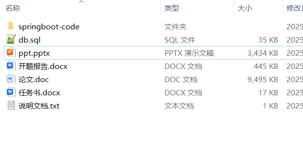

# springboot_salary_nursing_attendance

📦 SpringBoot多功能项目仓库 🎯

本仓库汇集了三个基于 **Spring Boot** 开发的高实用性项目，涵盖 **教师薪酬管理、敬老院管理、考勤管理** 等多个领域，适用于学习、开发实践和功能拓展！🚀

📊 **教师薪酬管理系统** —— 提供**工资核算、薪资发放、课时统计、绩效工资计算、工资单生成、财务报表分析**，优化**教师薪酬管理** 💰📑

🏡 **敬老院管理系统** —— 支持**老人健康档案、护理管理、入住登记、膳食安排、医疗护理、养老服务、安全监控、家属探视**，提升**养老院服务质量** 👴✅

⏳ **考勤管理系统** —— 实现**考勤签到、打卡管理、请假审批、迟到早退统计、考勤数据分析、异常提醒、绩效考勤**，优化**企业与校园考勤管理** 📋🚀

**项目部署说明**✨：

推荐使用：**谷歌浏览器**

**后台地址**😎

http://localhost:8080/springboot/admin/dist/index.html

**前台地址**😎

http://localhost:8080/springboot547vl/front/index.html

在**src\main\resources\application.yml中**编辑数据库配置🎉										
url:jdbc:mysql://127.0.0.1:3306/springbootuseUnicode=true&characterEncoding=utf8&useJDBCCompliantTimezoneShift=true&useLegacyDatetimeCode=false&serverTimezone=UTC
username: root
password: 123456

**文档预览**👀

**其他项目合集**✨

